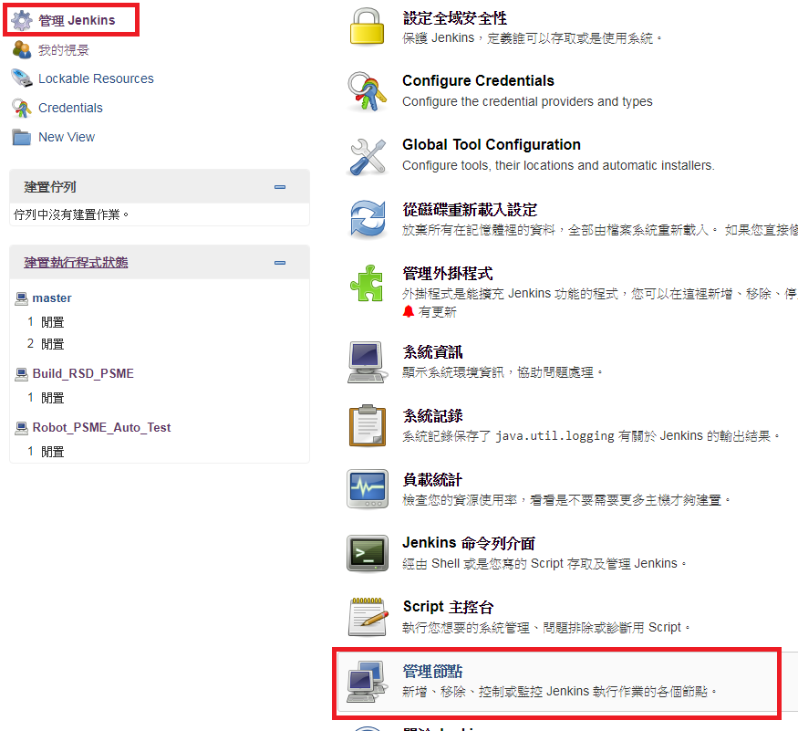
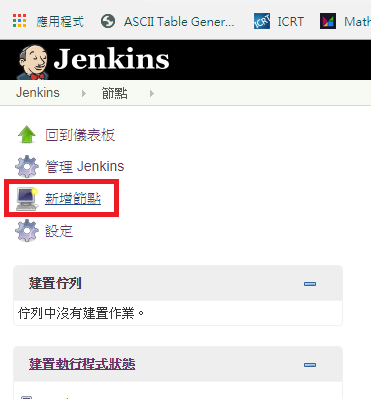
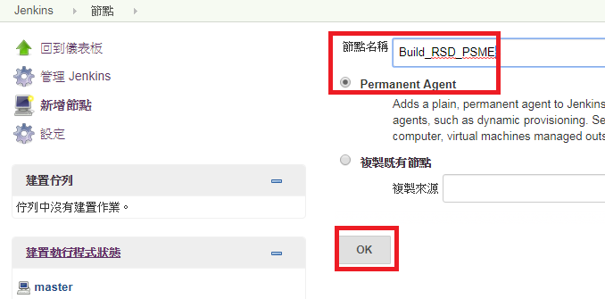
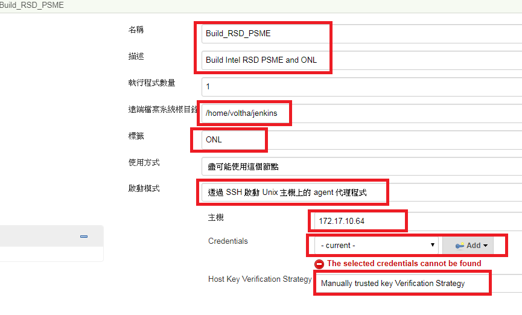
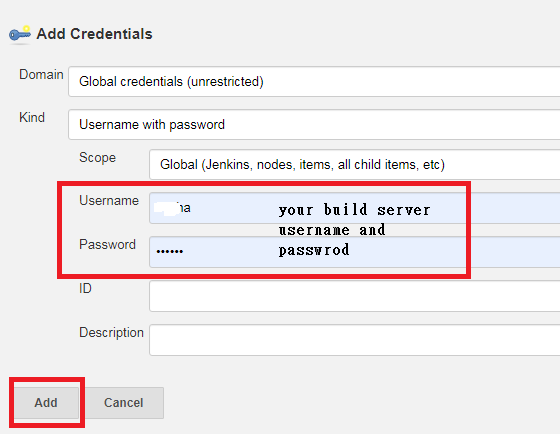
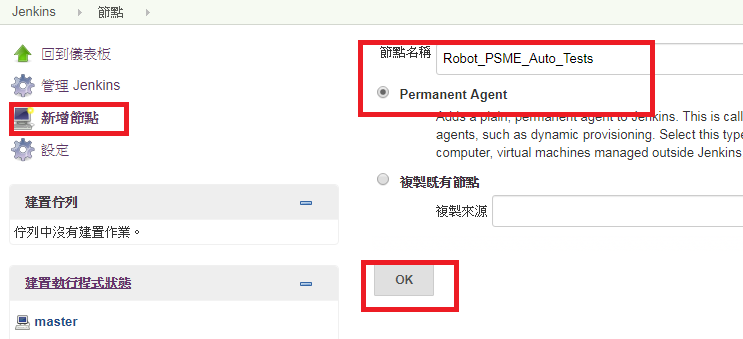
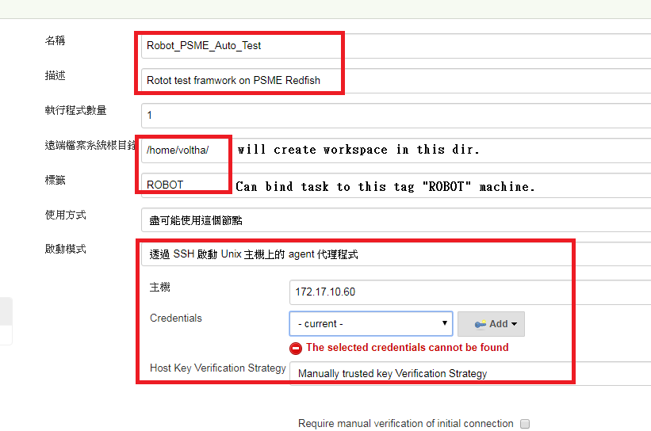

## Jenkins Installation Setup Guide ## 

* [Reference to](https://oranwind.org/-devops-jenkins-yu-centos-ubuntu-an-zhuang-jiao-xue/)

   1st Setup 


   ```
   sudo mkdir -p /data/jenkins
   ```

   ```
   sudo chown -R $USER:$GROUP /data
   ```

   ```
   docker run \
   --name jenkins \
   -d --restart always \
   -p 8080:8080 -p 50000:50000 \
   -v /data/jenkins:/var/jenkins_home \
   jenkins/jenkins:lts
   ```

   After container run up, enter container shell

   ```
   docker exec -i -t d672f161ae08 /bin/bash
   ```

   ```
   cat /data/jenkins/secrets/initialAdminPassword
   #cp above Password
   exit
   ```

   Open host browser

   ```
   http://localhost:8080
   ```

   Start config jenkins.


   Download plugins

   * [Robot framework](http://mirrors.jenkins-ci.org/plugins/robot/) 
   * [Publish Over SSH](https://updates.jenkins.io/download/plugins/publish-over-ssh/) 
   * [SSH plugin](https://updates.jenkins.io/download/plugins/ssh/) 

## Add Slave nodes ##

   * Create 2 Slave Agents 
      
      
      
      
      
      
      
      

