## Jenkins Installation Setup Guide ## 

## Add Build ONL RSD ##


*  Add system credentials used while need using ssh command to remote server.

   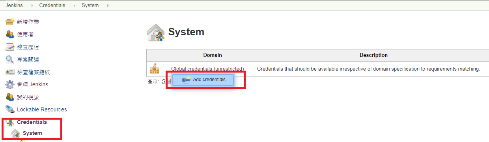 

*  User name and password for specific credentials. 

   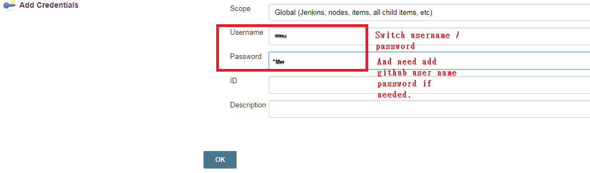 
   
   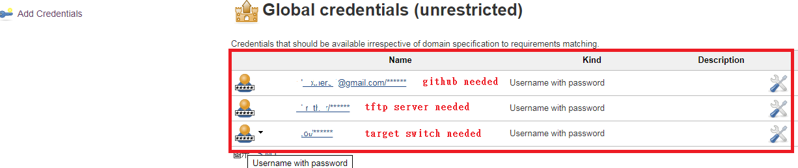 

*  Add remote SSH server 

   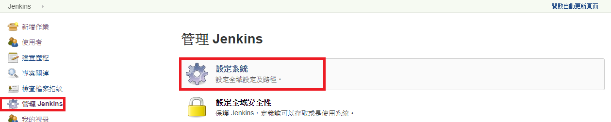 


   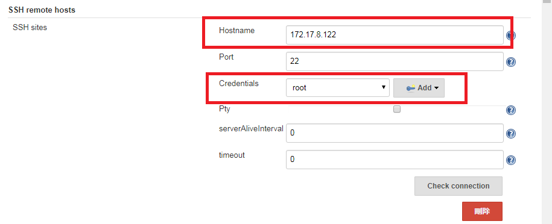 

 
   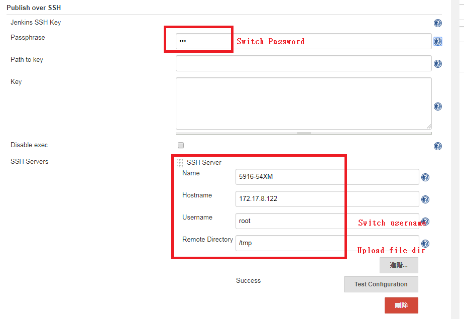 
   

*  Add "Build_ONL_RF" Task. 

   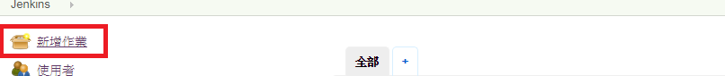 


   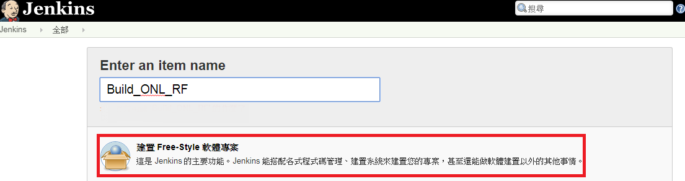 


*  Bind "Build_ONL_RF" Task to Slave node "Build_RSD_PSME".

   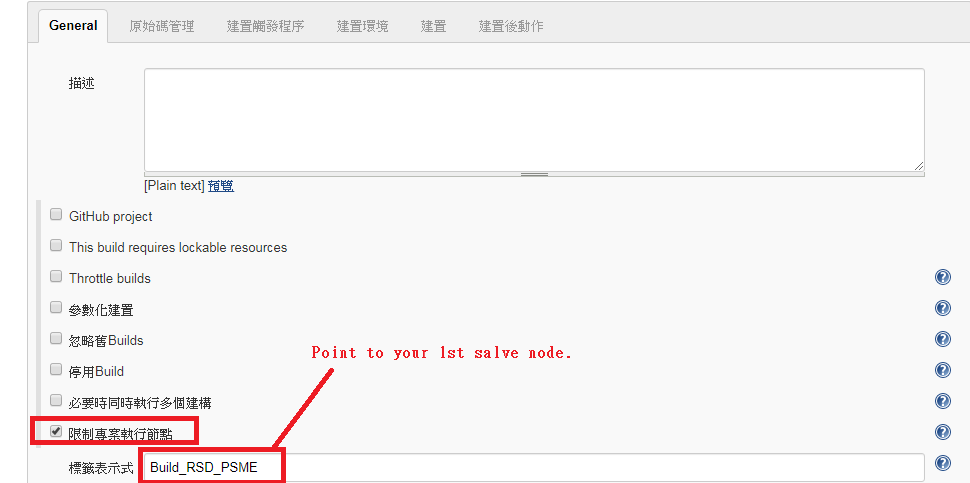 

*  Use following POST to triger this build task. 

   ```
   http://172.17.10.60:8080/job/Build_ONL_RF/build?token=05a8ab5 
   ```

   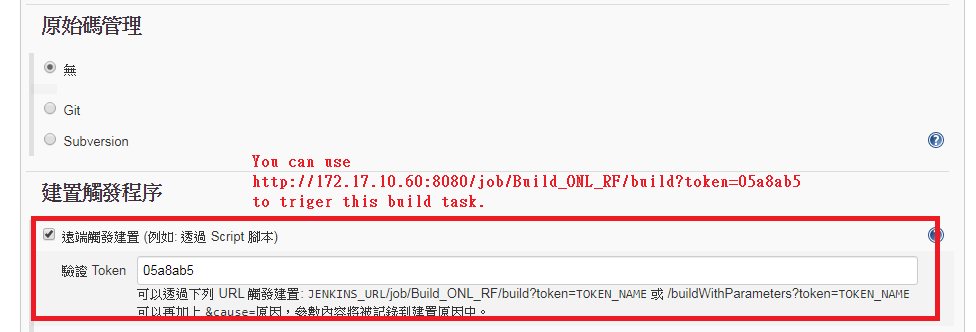 


*  Add shell command in this remote build server. 


   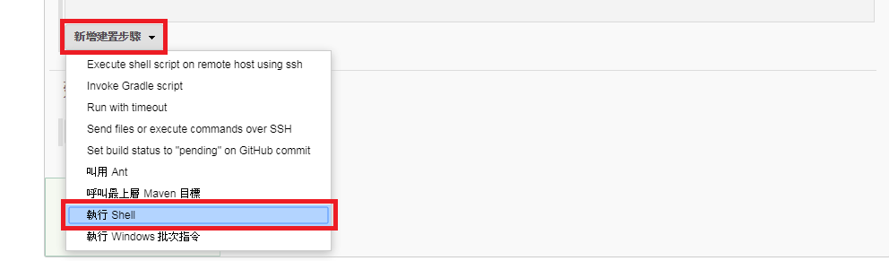 


   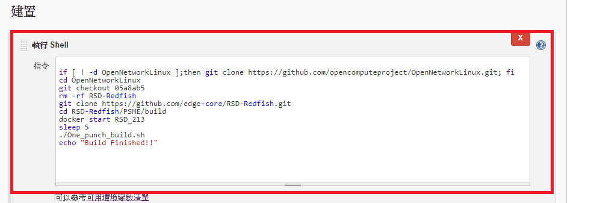 

   ```
   if [ ! -d OpenNetworkLinux ];then git clone https://github.com/opencomputeproject/OpenNetworkLinux.git; fi
   cd OpenNetworkLinux
   git checkout 05a8ab5
   rm -rf RSD-Redfish
   git clone https://github.com/edge-core/RSD-Redfish.git
   cd RSD-Redfish/PSME/build 
   docker start RSD_213
   sleep 5
   ./One_punch_build.sh
   echo "Build Finished!!"
   ```

*  Added target SSH server node. 

   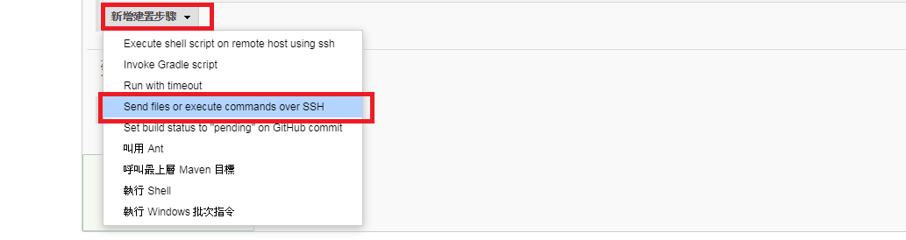 


   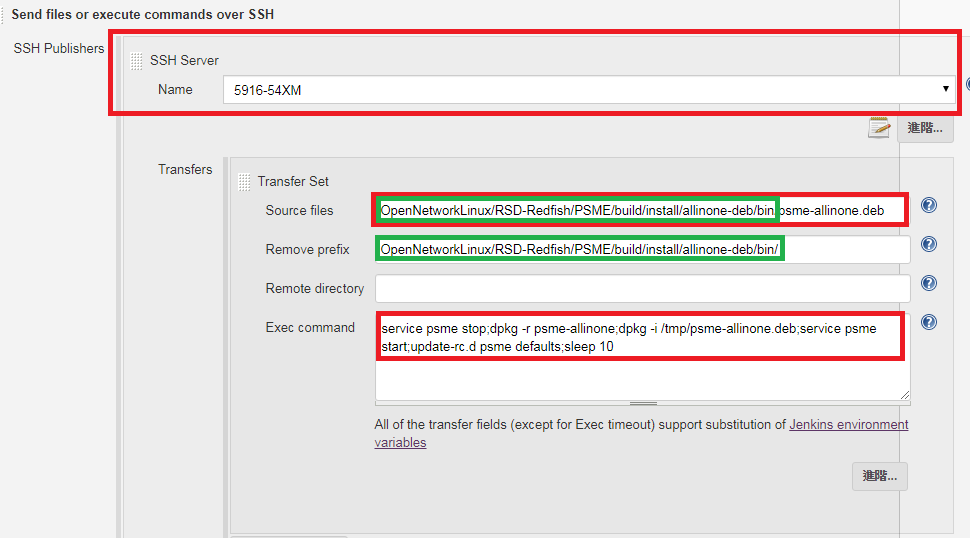 

## Add RF Auto Test Task ##


*  Added new task. 

    


   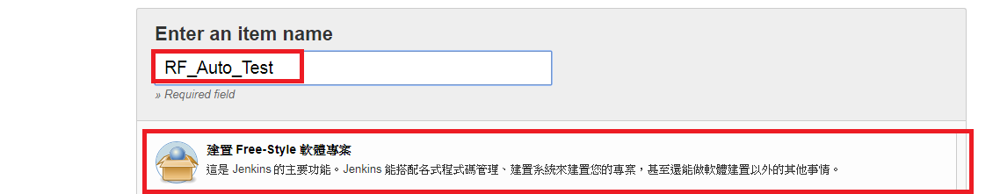 

*  Added new git url and specific slave node "Robot_PSME_Auto_Test" to run this task. 

   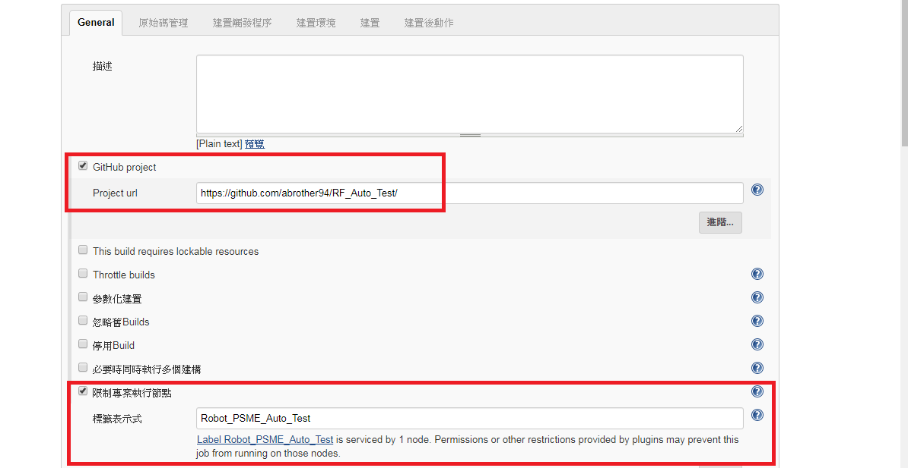 


*  Add git url and its credential.

   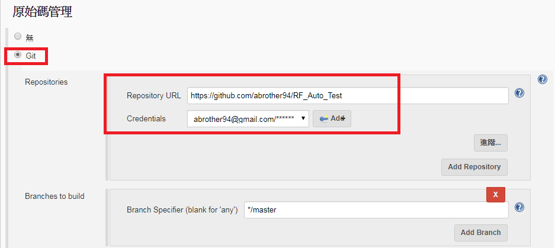 


*  This test will be triggered successful built "Build_ONL_RF" Task 

   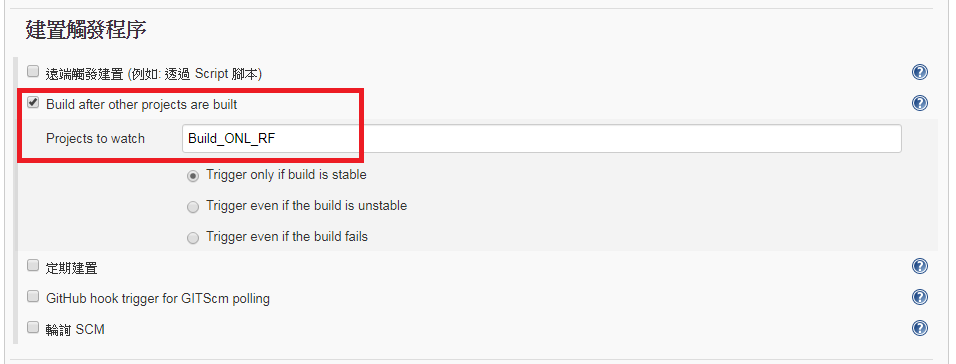 


*  Add robot auto test shell command. 

   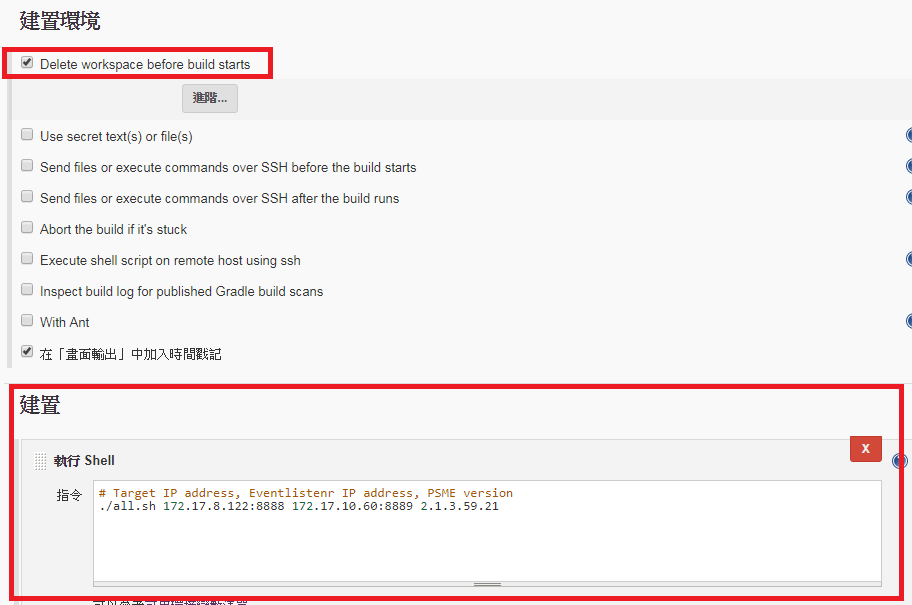 


*  After test need have report to recored.

   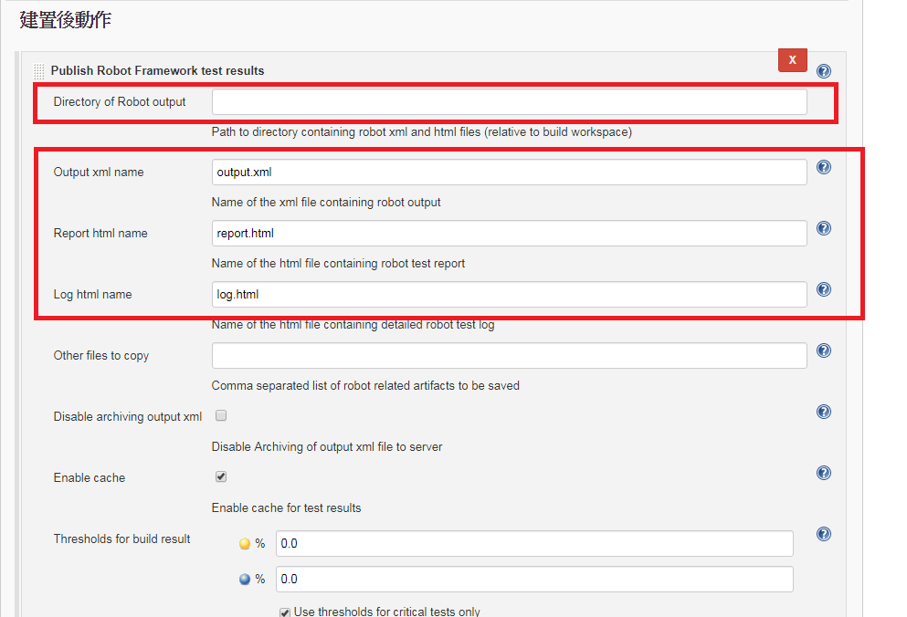 


*  Start build and test.

   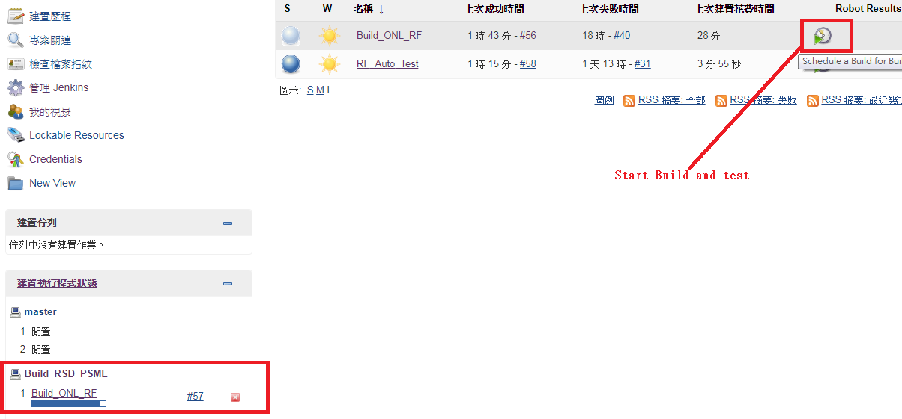 


